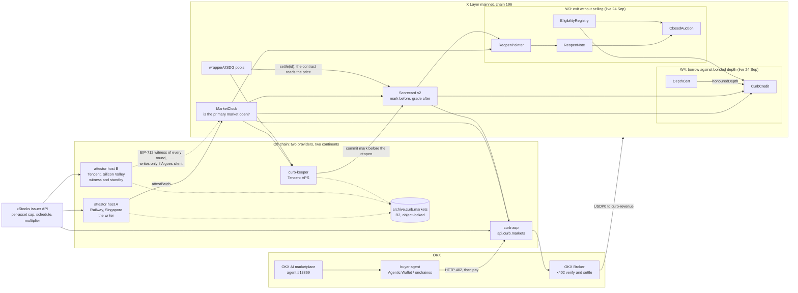

# Curb

**The market that trades when the exchange is shut.**

A tokenized Hong Kong stock on X Layer keeps trading for **141 h 20 m of every 168-hour week** while its issuer
caps creation and redemption at zero. For those hours the arbitrage that holds the token to the real share is
switched off, but the pool keeps trading. The window is scheduled and published, yet invisible on chain unless
you go looking for it. Lenders can't value those hours, and a holder who needs out has to sell into a thin book.
Curb is the market for those hours. It is built from four pieces: an on-chain clock that says when the primary
market is really shut, a record of Curb's own reopen prices that the chain grades, a paid API that sells both to
agents over x402, and instruments that let a holder exit or borrow without dumping the stock.

*(The 141 h 20 m figure is the published HKEX timetable minus the issuer's measured five-minute early cut before
every period end, which held 16 of 16 times; see [D-4](docs/DECISIONS.md). A US name is shut for the weekend,
about 48 h, plus a five-minute gap at each session boundary.)*

---

## Try Curb in 60 seconds

Commands 1, 2 and 4 need no account and no key. Command 3 spends one cent, and needs `onchainos` logged in to an
OKX Agentic Wallet that holds USD₮0 on X Layer.

```bash
# 1. Is Tencent's home market open right now? One free view call on MarketClock (Foundry's cast).
cast call 0x160Dc415902971a7a9B5ade7f43005b36FE5B09b "regime(address)(uint8)" \
  0x41333Df9E7639188BBfca5522dC4844398Af9f9E --rpc-url https://rpc.xlayer.tech
#    0 UNKNOWN (never attested, or stale > 30 min) · 1 CLOSED · 2 OVERNIGHT · 3 EXTENDED · 4 MARKET

# 2. Ask the paid API without paying: HTTP 402, the x402 challenge in PAYMENT-REQUIRED, a free preview in the body.
curl -si "https://api.curb.markets/v1/closure-calendar?symbol=wTCENTx"

# 3. Pay for the same answer with OKX's buyer CLI from an Agentic Wallet: $0.01 in USD₮0 on X Layer, settled by
#    the OKX Broker. `quote` reads the challenge and never signs; `pay` signs in OKX's TEE and replays the request.
onchainos payment quote "https://api.curb.markets/v1/closure-calendar?symbol=wTCENTx"
onchainos payment pay --payment-id <paymentId from the quote> --yes

# 4. Re-derive a Curb number instead of trusting it: the first Scorecard mark, from the chain and its archived
#    evidence. Needs Node >= 22.18.
npx -y github:OoJae/curb tx 0x1c839166a27d48e30a51da725b07e3b57bd00a6cc173395838e15d4b6481294e
```

Command 4 prints `REPRODUCED` and exits 0 when the evidence rebuilds what the transaction wrote, and exits 1 when
it does not. It installs the verifier from this repository. The npm registry name `curb-verify` is not Curb's.
More verbs and examples: [`docs/VERIFY.md`](docs/VERIFY.md).

## Why this matters now

- **Doesn't 24/7 minting solve this?** Only for six US names at one issuer. Ondo turned on 24/7 minting and
  redemption on 25 Jun 2026 for SPYon, QQQon, CRCLon, NVDAon, TSLAon and GOOGLon
  ([Ondo](https://ondo.finance/blog/real-24-7-trading-for-tokenized-stocks)). None is a Hong Kong name. The
  xStocks behind the X Layer wrappers still have creation and redemption capped at zero while their home market
  is shut (`primaryCapNow` reads 0).
- **Don't oracles already publish market status?** They publish the exchange calendar. Chainlink Data Streams'
  `marketStatus` reads 5 (closed) outside HKEX trading hours, including the lunch break and the closing auction
  ([Chainlink](https://docs.chain.link/data-streams/market-hours)). Pyth publishes Hong Kong equity prices only
  from 09:30 to 12:00 and 13:00 to 16:00 HKT on HKEX trading days
  ([Pyth](https://docs.pyth.network/price-feeds/core/market-hours)).
  A calendar can't see the issuer's cap, which reaches zero five minutes before every period ends (16 of 16
  times, [D-4](docs/DECISIONS.md)). Neither oracle publishes a reopen estimate that is graded on chain afterwards.
- **How does OKX price these hours?** OKX's Unified Tokenized Stocks trade 24/7, and "outside US market hours,
  pricing is based on the last close plus a market estimate"
  ([OKX, 7 Sep 2026](https://www.okx.com/en-us/help/okx-to-list-unified-tokenized-stocks-xshein-xkoru-and-more-for-spot-trading)).
  That is the kind of number Curb commits on chain before each reopen and has the contract grade afterwards.

## Live

Status as of **25 Sep 2026, 01:00Z**.

| what | where | status |
|---|---|---|
| Site | [curb.markets](https://curb.markets) | live since 24 Sep: the Week Ring, the live regime (the site turns to paper while Hong Kong is open), `/clock`, `/scorecard`, `/api`, `/notes`, `/depth`, `/brand` |
| MCP server (free, for AI agents) | `https://curb-mcp-production.up.railway.app/mcp` (Streamable HTTP; `mcp.curb.markets` once its DNS is in): six read-only tools, `curb_regime`, `curb_next_reopen`, `curb_scorecard`, `curb_credit`, `curb_corporate_actions`, `curb_paid_services`. Add it with `claude mcp add --transport http curb https://curb-mcp-production.up.railway.app/mcp`; agent skill in [`skills/curb/SKILL.md`](skills/curb/SKILL.md) | live since 25 Sep 02:28Z, a separate Railway project from the writers |
| Paid API (x402) | [api.curb.markets](https://api.curb.markets) · [`/healthz`](https://api.curb.markets/healthz) · [`/.well-known/x402`](https://api.curb.markets/.well-known/x402) | live since 24 Sep |
| OKX AI marketplace | [okx.ai/agents/13869](https://www.okx.ai/agents/13869): agent **#13869** "Curb", role ASP, three A2MCP services | registered 24 Sep ([`0xe2420407…ccc7`](https://www.oklink.com/xlayer/tx/0xe2420407a65b51a468f060a52496e15587ce13d1c23fccff30330d8ab293ccc7)) and submitted for listing review. Check it with `onchainos agent get-agents --agent-ids 13869` |
| Evidence archive | [`archive.curb.markets/index/latest.json`](https://archive.curb.markets/index/latest.json) (the bare domain serves no page; objects sit under `rounds/`, `marks/`, `witness/`) | object-locked since 22 Sep; host A, host B and the keeper publish every new bundle and witness statement since 24 Sep 20:32Z, and the history was backfilled after a check against the chain |
| MarketClock round evidence | [host A `/healthz`](https://attestor-a-production.up.railway.app/healthz), `/rounds/<inputRoot>.json` | live since 14 Sep |

## Contracts — X Layer mainnet (chain 196)

| contract | address | status |
|---|---|---|
| **MarketClock** | [`0x160Dc415902971a7a9B5ade7f43005b36FE5B09b`](https://www.oklink.com/xlayer/address/0x160Dc415902971a7a9B5ade7f43005b36FE5B09b) | deployed 13 Sep, Sourcify `exact_match` |
| **Scorecard v2** | [`0x3b4076c364AbDaE93e6419CeAdEEe8CB283BEf1f`](https://www.oklink.com/xlayer/address/0x3b4076c364AbDaE93e6419CeAdEEe8CB283BEf1f) | deployed 21 Sep, Sourcify `exact_match` |
| Scorecard v1 *(superseded)* | [`0x0527930187a879B3D8704a92734641679567EddD`](https://www.oklink.com/xlayer/address/0x0527930187a879B3D8704a92734641679567EddD) | kept, never recorded a row; why it was replaced is in [D-10](docs/DECISIONS.md) |
| **MarketClockStatus** (adapter) | [`0xD5EEeD33117c7B2B39EF1Dad7e0eeEDe6b9836d9`](https://www.oklink.com/xlayer/address/0xD5EEeD33117c7B2B39EF1Dad7e0eeEDe6b9836d9) | deployed 25 Sep, Sourcify `exact_match`: MarketClock's answer in Chainlink Data Streams' `marketStatus` codes (5 closed, 2 regular, 3/4 extended/overnight, 0 unknown), plus `isArbitraged`; guard library `src/lib/MarketClockGuard.sol` |
| EligibilityRegistry (notes) | [`0xd7251b562eD07374ccD2436a7EfC0bA3A28ce938`](https://www.oklink.com/xlayer/address/0xd7251b562eD07374ccD2436a7EfC0bA3A28ce938) | W3, deployed 24 Sep, Sourcify `exact_match` |
| ReopenPointer | [`0x85AB0FebdFa7201E65eA01bd3e4CC6F9c0Ac4471`](https://www.oklink.com/xlayer/address/0x85AB0FebdFa7201E65eA01bd3e4CC6F9c0Ac4471) | W3, deployed 24 Sep, Sourcify `exact_match` |
| ReopenNote (ERC-1155 `CURB-RN`) | [`0x7B2AcB0Db3316f7B8cf1B287796a2273871F011B`](https://www.oklink.com/xlayer/address/0x7B2AcB0Db3316f7B8cf1B287796a2273871F011B) | W3, deployed 24 Sep, Sourcify `exact_match` |
| ClosedAuction | [`0xAc74864d69DdB940ADfDB39E69751759a32bb80D`](https://www.oklink.com/xlayer/address/0xAc74864d69DdB940ADfDB39E69751759a32bb80D) | W3, deployed 24 Sep, Sourcify `exact_match` |
| EligibilityRegistry (makers) | [`0xbA1aB5027e826D564EA913b3f7acb95Fd651758E`](https://www.oklink.com/xlayer/address/0xbA1aB5027e826D564EA913b3f7acb95Fd651758E) | W4, deployed 24 Sep, Sourcify `exact_match` |
| DepthCert | [`0x702b1a988765f85162F4829175EF4232197e9C6D`](https://www.oklink.com/xlayer/address/0x702b1a988765f85162F4829175EF4232197e9C6D) | W4, deployed 24 Sep, Sourcify `exact_match` |
| CurbCredit | [`0x23c778c88C3ABf0Ad750f703C5F04cB3129ee339`](https://www.oklink.com/xlayer/address/0x23c778c88C3ABf0Ad750f703C5F04cB3129ee339) | W4, deployed 24 Sep, Sourcify `exact_match` |

Other addresses Curb depends on or owns:

| | address |
|---|---|
| X Layer Builder Code registry (ERC-721 `BUILDERCODE`); Curb's code is `dd7u50nckt5e729f` | `0xd6c426f9c077358735622ae5a83468dc0510823b` |
| USD₮0, the asset x402 payments settle in | `0x779ded0c9e1022225f8e0630b35a9b54be713736` |
| USDG, the stable in most wrapper pools (wXIAOx trades against USDC) and in W3/W4 | `0x4ae46a509F6b1D9056937BA4500cb143933D2dc8` |
| Every wallet Curb controls, and its funding graph | [`docs/WALLETS.md`](docs/WALLETS.md) |

The cohort MarketClock tracks (six Backed ERC-4626 wrappers):

| wrapper | address | venue | Scorecard price source |
|---|---|---|---|
| wTCENTx | `0x41333Df9E7639188BBfca5522dC4844398Af9f9E` | XHKG | `0xC89d8b547ceA7CdeAa7474E7a90B6baD01fE992f` |
| wSHEINx | `0xff637d2d435D6745Df3faf61272B1216e7e8b727` | XHKG | none: its only live pool has observation cardinality 1 |
| wXIAOx | `0x076CF393E701839FC7a5832D2c68AaFA235682AE` | XHKG | `0xdc7f2F41B48cD4F482D8C900Ac2fA1B5aD058417` |
| wMEITx | `0xad1b65C8556957cf23d1B5e9accdc449b415fA97` | XHKG | `0x54E89e9acaFb073e7fd8471312E753A661b470C7` |
| wNVDAx | `0xa8ddb5Cd96b5222AFe198316E9A57CAA642850D5` | XNAS | `0x2a2B11730C2b6d99a58034A869dd810D7300a7b2` |
| wAAPLx | `0x943BF64D566c32A2Bcd41AC92FB63C111cC9De8f` | XNAS | `0xc44bd9c8589026D28D1632d7b86b2Efb6cDc8fd2` |

Every transaction and verification record is in [`docs/DEPLOYMENTS.md`](docs/DEPLOYMENTS.md).

---

## How it works



Every transaction Curb's services send carries the ERC-8021 suffix for **X Layer Builder Code
`dd7u50nckt5e729f`**. That covers host A, host B and the keeper since 24 Sep. The `curb-desk` demo wallet
appends the same suffix to its W3/W4 transactions. OKLink shows the attribution next to each hash.

**MarketClock** (`src/MarketClock.sol`, MIT) says, per wrapper, whether the issuer's primary market is open:
`regime()` and `primaryCapNow()` (whole USD, 0 = shut). "Shut" is economic, not a calendar flag: the issuer's
per-asset order cap is zero. The contract fails closed: an attestation older than 30 minutes reads `UNKNOWN`
with capacity 0. Host A (`services/attestor`, `MODE=live`) writes a round when the state changes, when a
corporate action activates, and as a heartbeat about every 5.5 minutes. Every round commits a Merkle root of the
exact issuer bytes it was derived from, under a versioned method (`curb.marketclock.derive/1`, `/2`, `/3`).
Host B runs the same code as `MODE=standby`. It re-derives every round from a different provider, continent and
CDN edge, and signs the result as EIP-712. It writes only when the chain shows host A has gone silent.
Integration guide: [`docs/MARKETCLOCK.md`](docs/MARKETCLOCK.md).

**Scorecard v2** (`src/Scorecard.sol`) is where Curb's marks get graded. When a primary market shuts, the keeper
(`services/keeper`) commits a mark for the reopen. It does this ten minutes before capacity returns, under a
versioned method, with the evidence bundle fsynced first. Rows before block 71,486,953 use
`curb.scorecard.mark/1` (the pool's last price); later rows use `curb.scorecard.mark/2`, which moves the last
price by what trades while Hong Kong is shut, and commits the exact signal bytes it used ([D-13](docs/DECISIONS.md)). After the reopen, anyone can
call `settle(id)`. It takes no price: the contract reads the wrapper's pinned pool itself, through a
manipulation guard (spot must sit within 50 ticks, about 0.5%, of the pool's own 120-second average; see Honest
limits). It grades the mark against two baselines: the last print, and the pre-close price (the 15-minute closing
VWAP, or the last pool price when nothing traded). `skill()` counts strict wins only, so a tie is not a win.

**curb-asp** (`services/asp`) sells that data over x402 at `api.curb.markets`:
closure calendar $0.01, accuracy record $0.05, discount by duration $0.10. Payment is USD₮0 on X Layer,
scheme `exact`, verified and settled by OKX's Broker. An unpaid call returns HTTP 402 with a free preview.
Every paid answer gets an immutable receipt whose id binds the settlement transaction to the sha256 of the exact
bytes delivered. The service holds no key and sends no transaction. It is listed on the OKX AI marketplace as
agent #13869.

**W3, live since 24 Sep: sell the reopen, not the stock.** `ReopenPointer` records each shut → open transition
it observes on MarketClock, and one write-once reopen print per asset and epoch. `ReopenNote` (ERC-1155) escrows
wrapper shares while the market is shut and delivers exactly those shares after the verified reopen, or after 10
days as a fallback. `ClosedAuction` sells a note through a descending-price clock that clears with a single
bidder, only while the market is still shut. `EligibilityRegistry` is the allowlist for bidders and borrowers.
Pointer, Note and Auction have no admin.

**W4, live since 24 Sep: borrow against depth someone has bonded.** `DepthCert` is a bonded firm bid with no
admin: the maker posts a bid with a bond of at least 10% of its notional. If a taker delivers shares and the
maker's payment fails, the fade is proved on chain in the same transaction and the whole bond goes to the taker.
`CurbCredit` publishes `ltvFor(asset)`. It is 0 when the clock is stale, the price is unreadable or no bonded
depth exists. Otherwise it is the lower of two numbers. One is a regime cap: 60% while primary capacity is on,
30% while it is shut. The other is what the bonded bids naming the credit line would actually pay for the
collateral, at the lowest bid, as a fraction of its pool value. A bid counts only if it outlives
`minCertExpiry(asset)`, which covers the next reopen plus a full 30-minute cure. While the market is open that is
now + 1 h + 30 min; if the next transition is a close less than 1 h 30 min away (the Hong Kong names), it is that
close + 73 h + 30 min. While the market is shut it is now + max(73 h, time to the next transition + 1 h) + 30 min.
A refused borrow emits `Refusal` and changes nothing. A breach cure clock counts only witnessed open-market time,
and liquidation needs 30 such minutes. Nobody is liquidated while MarketClock (single-signer; see Honest limits)
attests the market shut, or while its attestation is stale. Anyone may `fund` the lending reserve, but funding
issues no shares and only the admin can `defund`, so it is a donation. Never transfer tokens straight to a Curb
contract: none of them can return tokens sent outside its own functions. Exact rules: the NatSpec in
[`src/CurbCredit.sol`](src/CurbCredit.sol). Design spec: [`docs/specs/W3W4-contracts.md`](docs/specs/W3W4-contracts.md).

---

## Verify it yourself

Nothing here asks to be trusted. Every step below uses only public endpoints.

```bash
# Contracts: unit tests, then fork tests against live X Layer state (RPC: rpc.xlayer.tech, set in foundry.toml)
forge test --no-match-path 'test/fork/*'
forge test --match-path 'test/fork/*' -vv

# Services: Node >= 22.18 (TypeScript runs directly). Each suite runs under four host timezones.
(cd services/attestor && npm ci && npm test)
(cd services/keeper   && npm ci && npm test)
(cd services/asp      && npm ci && npm test)

# curb-verify: re-derive a Curb number from its published evidence (needs the attestor and keeper deps above)
node tools/curb-verify/src/cli.ts selftest            # two real mainnet rounds, no network
ROOT=$(curl -s https://attestor-a-production.up.railway.app/healthz | jq -r .lastRound.root)
node tools/curb-verify/src/cli.ts bundle "https://attestor-a-production.up.railway.app/rounds/$ROOT.json"
node tools/curb-verify/src/cli.ts tx <any MarketClock or Scorecard tx hash>   # starts from the chain
node tools/curb-verify/src/cli.ts range 71231806..latest                        # every row in a block range

# Read the chain directly
RPC=https://rpc.xlayer.tech
cast call 0x160Dc415902971a7a9B5ade7f43005b36FE5B09b "regime(address)(uint8)" \
  0x41333Df9E7639188BBfca5522dC4844398Af9f9E --rpc-url $RPC      # 0 UNKNOWN, 1 CLOSED, 2 OVERNIGHT, 3 EXTENDED, 4 MARKET
cast call 0x3b4076c364AbDaE93e6419CeAdEEe8CB283BEf1f "skill()(uint256,uint256,uint256)" --rpc-url $RPC
                                                                  # (settled, beat last print, beat closing VWAP)

# Ask the API without paying: HTTP 402, the x402 challenge in PAYMENT-REQUIRED, a free preview in the body
curl -si "https://api.curb.markets/v1/closure-calendar?symbol=wTCENTx"
```

`curb-verify` rebuilds the Merkle root, checks every leaf preimage, and re-runs the committed method on the
committed inputs. It exits 0 when the evidence reproduces and 1 when it does not. Its verbs are `bundle`,
`witness`, `selftest`, `tx <hash>` (start from the transaction; it finds the evidence in the archive) and
`range <from>..<to>`. Every deployed contract is verified on Sourcify (chain 196, `exact_match`).

---

## Raw xStock or ERC-4626 wrapper, path by path

What trades on X Layer is not the rebasing xStock. It is a Backed ERC-4626 wrapper whose share price already
contains every corporate action ever applied (`wAAPLx.convertToAssets(1e18) == AAPLx.multiplier()`, asserted in
`test/fork/MarketClock.t.sol`). The multiplier is not monotonic: splits, reverse splits and spin-offs all move it.
So every Curb path states its unit:

| path | unit | note |
|---|---|---|
| MarketClock | keyed by **wrapper**; reads the **raw** token | The issuer's cap is on the raw xStock's primary market. Each wrapper is registered with its own on-chain `asset()`, and the raw token's multiplier nonce drives `isInMultiplierBlackout`. `rawToShares(wrapper, s)` is `convertToAssets(s)`. |
| Scorecard | **wrapper** shares, priced from the wrapper's own pool | The mark, both baselines and the settlement price are all USD per whole wrapper share, so no multiplier enters the grade. |
| curb-asp | issuer data by **raw** symbol (TCENTx), reported under the **wrapper** (wTCENTx) | Record and curve prices are wrapper-pool prices, the same as Scorecard. |
| ReopenNote | **wrapper** shares, physically delivered | It delivers exactly the shares escrowed. `rawToShares` and the nonce at mint are recorded as provenance only. Redemption is not blocked during a blackout, because the 4626 share absorbs the corporate action. |
| ClosedAuction | USDG against the **wrapper** value at `priceNow` | |
| DepthCert | size in **wrapper** shares; bid in USDG per whole wrapper share | |
| CurbCredit | collateral in **wrapper** shares, valued at Scorecard's `priceNow` | It never converts to raw. |

Curb never holds or moves the raw rebasing token. If you compare a wrapper price to underlying spot, call
`rawToShares` first. Otherwise you are wrong by the accrued multiplier, and that error never resets.

---

## Honest limits

- **The record has no wins yet.** Read it live with `skill()`. The 15 rows before block 71,486,953 used
  `curb.scorecard.mark/1`, whose only input is the pool: the mark *is* the last print, so every one tied by
  construction. The reopens were not quiet: they moved 0 to 105 bp. The fix is `curb.scorecard.mark/2`, which adds
  a signal that trades while Hong Kong is shut ([D-13](docs/DECISIONS.md)). Its first three rows (25 Sep 01:30Z
  reopen) **all lost**: the signal called Tencent, Xiaomi and Meituan up and HKEX opened all three down, so as of
  25 Sep 01:36Z `skill()` reads (18, 0, 0). Old rows keep the method that produced them, and no row is ever
  re-marked. Two more things the record shows: the pools **do** trade while primary capacity is off (15, 63 and
  141 swaps in the 22–24 Sep lunch recesses, most of them on wXIAOx), and five minutes after a reopen, when the
  Scorecard reads it, a pool can lag the real market (wTCENTx's pool −13 bp against 0700.HK −114 bp on 25 Sep).
- **Every demo counterparty is a team wallet, and says so.** The first paid call (24 Sep, $0.01) was the team's
  Agentic Wallet paying the team's revenue wallet. It proves the payment rail, not demand. The W3/W4 demos run
  only between team wallets (curb-desk, the Agentic Wallet, the deployer). Every address and its funding path is
  in [`docs/WALLETS.md`](docs/WALLETS.md).
  None of it is presented as third-party usage.
- **Attestation is single-signer.** MarketClock's verified NatSpec says "quorum-signed off-chain". That describes
  the intended design, and the deployed source can't be edited. Any one of the three enabled attestor keys (host
  A, host B, a cold spare) can write a round alone. Host B's signed witness is an attributable second check, not
  a quorum.
- **A settler can nudge the graded price.** `settle` and `recordPrint` read the pool's spot price, refused only
  when it is more than 50 ticks (about 0.5%) from the pool's 120-second average, and a swap in the same block does
  not enter that average. Settlement is permissionless, so a caller who swaps, settles and swaps back in one
  transaction can move the recorded price by up to that much. Who settled each row is on chain.
- **`stateOf()` does not fail closed.** Integrations must read `regime()` or `primaryCapNow()`.
- **Coverage has gaps, deliberately.** wSHEINx has no price source (cardinality-1 pool). Closures shorter than
  30 minutes are not marked. A closure whose start the keeper did not witness is not marked.
- **Published errata.** The first seven MarketClock rounds (14 Sep) overstated capacity 100x. Regimes were
  correct throughout ([D-7](docs/DECISIONS.md)).
- **Receipts are unsigned.** Round bundles, mark bundles and host B's witness statements are public and
  write-once in `archive.curb.markets`. The paid API's receipts are not: they are only as trustworthy as the API
  host's disk.
- **W3/W4 are small and new.** The note caps are 175 wTCENTx, 220 wNVDAx and 14 wAAPLx shares, sized to depth
  measured on a fork ([D-3](docs/DECISIONS.md)). What was cut, and why, is in D-12.

---

## Built during the 17–25 Sep build window

Curb started before the window. **Dating evidence:** the git history starts on 21 Sep with one initial commit
(`cc03fa7`) that holds both earlier and in-window work. Commit dates alone therefore can't separate the two.
The on-chain transactions and the Sourcify verification times can, and they are cited below. Dates are UTC.

**Before 17 Sep (already existed)**

| date | what | evidence |
|---|---|---|
| 12–13 Sep | W0 measurements: the issuer's cap-to-zero definition of "closed", Chainlink Data Streams checked on X Layer, depth measured by real swaps on a fork | [D-1, D-2, D-3](docs/DECISIONS.md); `artifacts/w0/` |
| 13 Sep 15:55 | MarketClock and Scorecard v1 deployed, 6 wrappers registered | tx [`0xf07b183b…4524`](https://www.oklink.com/xlayer/tx/0xf07b183bb2ea147687cf6eac2058f4c48e0825b16963c822bdbd67f5135f4524), block 70,545,887; Sourcify verified 13 Sep 15:59 |
| 14 Sep 11:46 | First attestation; host A live | tx [`0x8e87d0f0…47e1`](https://www.oklink.com/xlayer/tx/0x8e87d0f08af4025a742c377dce985449b3b131b3a61e64b0bb793b822fcd47e1), block 70,617,365 |
| 14 Sep 12:16 | `derive/2`: cap unit corrected | tx [`0xaec29e1a…b9bd`](https://www.oklink.com/xlayer/tx/0xaec29e1a3dfd80a85581d387b1a0e01ed323cbcaf74440b2298bf6e55e6eb9bd), [D-7](docs/DECISIONS.md) |
| 14 Sep | Host B deployed (13:47); armed 20:02 | `setAttestor` tx [`0x90f87de8…de9a`](https://www.oklink.com/xlayer/tx/0x90f87de8fa1e7c79101996108a83012540d80c9e4c45b0a9210800956b71de9a), block 70,647,127 |

**New during the window**

| date | feature or integration | evidence |
|---|---|---|
| 18 Sep | The recess rule settled. Over 15–18 Sep the issuer ended every period 300 s early, 16 of 16 times, seen from three vantage points | CLOSED rounds in blocks 70,675,471 · 70,761,870 · 70,848,267 · 70,934,670; [D-4](docs/DECISIONS.md) |
| 20 Sep 22:23 | `derive/3`: cohort coherence and confirm-before-open, after a CDN race found on 17 Sep; both hosts redeployed | first round tx [`0x20dd8be0…df5c`](https://www.oklink.com/xlayer/tx/0x20dd8be052b58035e38a3c0cdc8ca2e4f7986fecb6aa596f66f495b7f6c1df5c), block 71,173,967; [D-9](docs/DECISIONS.md) |
| 21 Sep 14:27 | **Scorecard v2**: `settle(id)` takes no price; pinned, write-once, cardinality-checked price sources | deploy tx [`0x01325c45…d30d`](https://www.oklink.com/xlayer/tx/0x01325c45c9d221820914ecd5534e22b7b89d4239e14d7de48b44eea77921d30d), block 71,231,806; Sourcify verified 14:31; [D-10](docs/DECISIONS.md) |
| 21 Sep 15:17 | **curb-keeper** live: a mark committed before every eligible reopen, settled after it | `setKeeper` tx [`0xb9f80b25…37ce`](https://www.oklink.com/xlayer/tx/0xb9f80b25297ccb42b1127c72ac38f5591270eacdf56cd7a8aec4f154f3e837ce); `services/keeper` |
| 21 Sep | Liveness checks and emergency paging for all hosts | [`docs/DEPLOYMENTS.md`](docs/DEPLOYMENTS.md), "Monitoring" |
| 21 Sep | **curb-verify**, and `checkMarkRound` (a row checked against the chain, not just itself) | commits `12ab284`, `1467312` |
| 21 Sep | Aave ARFC and LP outreach drafted | commits `ebcaa13`, `87b75f4` |
| 22 Sep 04:50 / 05:05 | **First Scorecard rows** committed and settled | commit tx [`0x1c839166…294e`](https://www.oklink.com/xlayer/tx/0x1c839166a27d48e30a51da725b07e3b57bd00a6cc173395838e15d4b6481294e) (block 71,283,582); settle tx [`0x84b5ccb1…fb4c`](https://www.oklink.com/xlayer/tx/0x84b5ccb1ad95150eb32a060eee8600041d0b55725e14a21d93594969fe36fb4c) (block 71,284,480); commit `3e82808`; [D-11](docs/DECISIONS.md) |
| 22 Sep | `curb.markets` registered; **archive** on R2 with indefinite object locks on `rounds/`, `marks/`, `witness/` | commit `3e82808` |
| 24 Sep 01:39 | **X Layer Builder Code** `dd7u50nckt5e729f` minted | tx [`0xc3315eb4…051b`](https://www.oklink.com/xlayer/tx/0xc3315eb4785c394567ee74e86ee6210443bb0ea80fac8564d15a4598482f051b), block 71,444,945; commit `e4bd194` |
| 24 Sep 06:27 | **Builder Code attribution** (ERC-8021) on every Curb transaction: host A, host B, keeper | code `aa0f373`; first attributed round tx [`0x5d3c92ab…605e`](https://www.oklink.com/xlayer/tx/0x5d3c92ab02abb2adbde73babc07a0eed739237f5cd36745c80ba6d123e45605e), block 71,462,192; commit `d3bfc40` |
| 24 Sep | **curb-asp**: x402 API settled through the OKX Broker, live at `api.curb.markets` | commits `a8474dd`, `d3bfc40` |
| 24 Sep 09:44 | **OKX AI marketplace** agent #13869: three A2MCP services, submitted for review; priced routes answer OKX's bare-POST self-check with 402 | tx [`0xe2420407…ccc7`](https://www.oklink.com/xlayer/tx/0xe2420407a65b51a468f060a52496e15587ce13d1c23fccff30330d8ab293ccc7), block 71,474,047; commit `474e820` |
| 24 Sep 11:56 | **First paid call** end to end through OKX's buyer CLI: $0.01 USD₮0, team wallet to curb-revenue, with a receipt | settlement tx [`0xe8740458…4de7`](https://www.oklink.com/xlayer/tx/0xe8740458e49025873da915705e05c8a1156882813e81411caea1d2f8ce1b4de7), block 71,481,945; [receipt](https://api.curb.markets/receipts/0xcee1ee75f7323746b96afa5f4056640507a96d02316ba40f9010ac2d58a9817c.json); commit `b70a75f` |
| 24 Sep | W3/W4 contract spec frozen; shared scaffold merged; demo wallet disclosed before its first transaction | commits `b70a75f`, `0995f72` |
| 24 Sep | **`curb.scorecard.mark/2`**: a mark that moves with the Binance perp and the US ADRs while Hong Kong is shut, with a byte-exact relay for the Binance leg; mark/1's range closes at block 71,486,953 | commits `c7e80b6`, `af68ee1`; [D-13](docs/DECISIONS.md) |
| 24 Sep | **curb-verify `tx` and `range`**: start from any transaction hash; runs from this repository with `npx -y github:OoJae/curb` | commit `08f2a11` |
| 24 Sep | Corporate actions as a free read-only feed in curb-asp; a fork replay of HONx's reverse split and spin-off against MarketClock | commits `5761957`, `8715db2` |
| 24 Sep ~18:00 | **W3 on mainnet**: ReopenPointer, ReopenNote, ClosedAuction, EligibilityRegistry, all Sourcify `exact_match` | blocks 71,503,708–71,503,723; commit `424f4bf`; [`docs/DEPLOYMENTS.md`](docs/DEPLOYMENTS.md) |
| 24 Sep ~19:15 | **W4 on mainnet**: DepthCert, CurbCredit and the maker allowlist, all Sourcify `exact_match` | blocks 71,507,846–71,507,867; commit `e0b8ae7` |
| 24 Sep | **curb.markets**: the site, with the Week Ring (2,016 blades, one per five-minute slot of the Hong Kong week) and the live regime | foundation commit `35b9854` |
| 24 Sep 19:20 / 19:24 | **W3 demo, cycle 1** (team wallets): note 1 minted on 0.1 wTCENTx while Hong Kong was shut, listed, and sold to the team's Agentic Wallet at 03:24 HKT for 5.595137 USDG, 35 bp under the reference | mint tx [`0xcf3dfa55…1c40`](https://www.oklink.com/xlayer/tx/0xcf3dfa55bc02bf0cec35422cc3561a98e7bb79bb779d13c27f51f3df277a1c40) (block 71,508,619); bid tx [`0xf23e727c…d3d3`](https://www.oklink.com/xlayer/tx/0xf23e727c1a37c111e339f480caf15bf67cf2671139f355d11853ec1188cfd3d3) (block 71,508,807); [`docs/DEPLOYMENTS.md`](docs/DEPLOYMENTS.md), "Live demo on mainnet" |
| 24 Sep 20:32 | **Archive publisher live** on host A, host B and the keeper; history backfilled, each object checked against the chain first | commit `66d7b89` |
| 24 Sep 21:30 | **W4 demo** (team wallets): a 1.4 USDG borrow with no bonded depth emits `Refusal(NoDepth)` inside a successful transaction, and nothing moves | tx [`0x8bd873d7…5c7a`](https://www.oklink.com/xlayer/tx/0x8bd873d77176dab81ad860c1496937d2e7535c8a6b91f0be5902936b408b5c7a) (block 71,516,369) |

**Still to come (25 Sep, UTC).** Each step is added to `docs/DEPLOYMENTS.md` with its transaction when it lands.

- ~01:20 / 01:35: the first `curb.scorecard.mark/2` rows, committed before the 01:30 Hong Kong reopen and settled
  after it.
- 01:30: cycle 1 ends. The reopen is observed, `recordPrint` runs at +300 s, the Agentic Wallet redeems note 1,
  and `realisedDiscountBps(1)` grades the price it paid.
- ~04:00: cycle 2, a second note minted and auctioned during the lunch recess, redeemed after the 05:00 reopen.
- 05:15: a bonded bid (DepthCert) naming CurbCredit lifts `ltvFor(wTCENTx)` from 0; the Agentic Wallet borrows
  1.4 USDG.
- 07:55: the issuer's cut shuts the market and the LTV cap falls to 30%; `flagBreach` starts a cure clock that
  stays frozen while Hong Kong is shut.
- The demo video.

---

## Repository layout

```
src/                 Solidity (MIT): MarketClock, Scorecard, ReopenPointer, ReopenNote, ClosedAuction,
                     EligibilityRegistry, DepthCert, CurbCredit
  interfaces/ lib/   frozen interfaces, MulDiv, SafeTransfer, ERC1155Min
test/                unit tests; test/fork/ runs against live X Layer state; test/mocks/
script/              Deploy.s.sol, DeployScorecardV2.s.sol, DeployW3.s.sol, DeployW4.s.sol
  hostb/deploy.sh    idempotent deploy of host B, the keeper and the W0 observer to the VPS
  asp/               the exact OKX marketplace listing text, services and avatar as submitted
  w0/                the issuer-API observer used for the W0 measurements
  w3/ w4/            the reopen watcher and the demo runbooks for notes, depth and credit
services/
  attestor/          MarketClock writer (host A) and witness/standby (host B)
  keeper/            Scorecard mark producer and settler
  asp/               curb-asp, the x402 API behind agent #13869
tools/curb-verify/   the verifier CLI
tools/archive/       the archive backfill (checks every object against the chain before upload)
docs/                DECISIONS, DEPLOYMENTS, WALLETS, MARKETCLOCK, specs/, the ARFC and outreach drafts,
                     SUBMISSION, HYGIENE
artifacts/w0/        raw measurement evidence (depth curve, issuer observations)
broadcast/           Foundry broadcast records of every mainnet deploy
video/               the demo video: voiceover script, HyperFrames composition, capture tools
web/                 curb.markets: Vite MPA, three.js Week Ring, GSAP
.railway/            Railway infrastructure as code
lib/forge-std/       vendored (MIT / Apache-2.0)
```

## Licence

MIT, for the whole repository ([`LICENSE`](LICENSE)): the contracts, the services, the verifier, the site and the
video tooling. Every Solidity file in `src/` also carries an SPDX header. MarketClock is deliberately free to read
and integrate, with no key and no fee. See [`docs/MARKETCLOCK.md`](docs/MARKETCLOCK.md). Vendored code keeps its
own licence: `lib/forge-std/` is MIT or Apache-2.0.

## Further reading

- [`docs/DECISIONS.md`](docs/DECISIONS.md): every design decision, measurement and erratum, with reproduction steps
- [`docs/DEPLOYMENTS.md`](docs/DEPLOYMENTS.md): every deploy, transaction and verification
- [`docs/WALLETS.md`](docs/WALLETS.md): every Curb wallet and its funding graph, published in advance
- [`docs/MARKETCLOCK.md`](docs/MARKETCLOCK.md): the integration guide
- [`docs/VERIFY.md`](docs/VERIFY.md): re-deriving any MarketClock round or Scorecard mark with `curb-verify`
- [`docs/SUBMISSION.md`](docs/SUBMISSION.md): the OKX Dev Day submission answers
